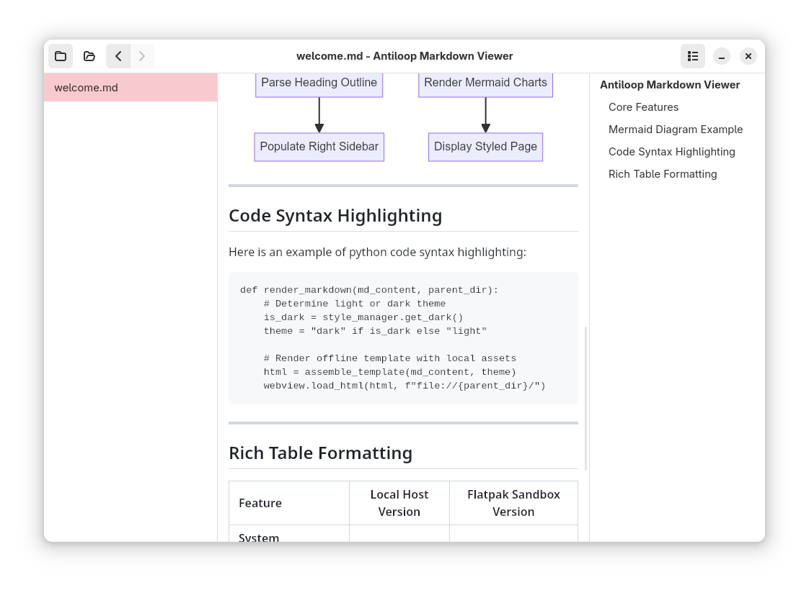

# Antiloop Chiru

A premium, offline-first Markdown viewer built using **Python 3**, **GTK4**, **Libadwaita**, and **WebKit**. 

It provides a native Linux GTK look and feel, fits seamlessly into GTK desktop environments, and supports advanced formatting features like tables, code syntax highlighting, and Mermaid diagrams—all fully offline.



## Core Features

*   📂 **Double Sidebars & Persistent States**:
    *   **Left Sidebar (File/Directory Explorer)**: Live tree-like directory browser displaying folders first (with folder icons) and Markdown files (with document icons) alphabetically. Supports deep folder navigation.
    *   **Right Sidebar (Document Outline)**: Interactive document outline automatically generated from headings, allowing smooth scrolling to sections.
    *   **Persisted Layout**: Remembers the open/closed visibility states of both sidebars across file switches and application restarts.
*   🔄 **Automatic Reopening & Recent Files**:
    *   Restores the last opened document automatically on application startup.
    *   Dropdown menu in the header bar showing the last 10 explicitly opened files with styled filenames and ellipsized directory paths.
*   ⚡ **Live Hot-Reloading & File/Folder Monitoring**:
    *   **Live Document Reload**: Watches the currently open file and automatically refreshes the viewer when it is modified on disk.
    *   **Live Sidebar Update**: Monitors the directory for changes, updating the files and folders list in real-time as items are added, deleted, or renamed.
*   📊 **Full-Width Canvas & Premium Formatting**:
    *   Responsive, 100% full-width document canvas allowing wide Mermaid diagrams (flowcharts, sequence diagrams, Gantt charts, etc.) and tables to scale up and remain fully legible.
    *   Theme-synchronized, clean table header styles.
*   🔍 **Flatpak Portal Path Resolution**:
    *   Translates sandboxed portal paths (`/run/user/...`) to their real host paths on launch via FUSE extended attributes (`xattr::document-portal.host-path`). This unlocks access to relative images and folder lists even when the app is started from file managers or CLI.
*   🌓 **Theme Synchronization**: Listens to system settings and automatically switches between light and dark modes.
*   💻 **Syntax Highlighting**: Real-time theme-synchronized code formatting for multiple languages (Python, JavaScript, YAML, etc.).
*   🔒 **Secure Sandbox (Flatpak)**: Runs in an isolated Flatpak container with minimum required permissions.

---

## Installation & Running (Flatpak)

The app ships as **two runtime variants** from a single source tree. Which one
you build determines only the look — the application code adapts automatically
(see [`src/core/platform.py`](src/core/platform.py)):

| Variant | Manifest | Runtime | Use for |
| :-- | :-- | :-- | :-- |
| **GNOME** | `com.antiloop.MarkdownViewer.gnome.yml` | `org.gnome.Platform` | Flathub & general use (native libadwaita look on GNOME and most desktops) |
| **elementary** | `com.antiloop.MarkdownViewer.yml` | `io.elementary.Platform` | AppCenter (native Pantheon look on elementary OS) |

Both manifests share the same build steps via `antiloop-md-viewer.module.yml`,
so they cannot drift apart.

> ⚠️ Do **not** ship the elementary variant to Flathub: its bundled Granite
> runtime forces the elementary theme onto every desktop, including GNOME.

1. **Install Flatpak-Builder and the matching SDK/Platform**:
   ```bash
   sudo dnf install -y flatpak-builder
   # GNOME variant (recommended for local dev on non-elementary systems):
   flatpak install flathub org.gnome.Sdk//50 org.gnome.Platform//50
   # elementary variant (for AppCenter):
   flatpak install org.freedesktop.Platform.GL.default//23.08   # required driver, see Troubleshooting
   ```
2. **Build and Install Locally**:
   ```bash
   # GNOME variant:
   flatpak-builder --user --install --force-clean build-dir com.antiloop.MarkdownViewer.gnome.yml
   # …or the elementary variant:
   flatpak-builder --user --install --force-clean build-dir com.antiloop.MarkdownViewer.yml
   ```
3. **Launch the Application**:
   You can launch the app from your Application menu or via terminal:
   ```bash
   flatpak run com.antiloop.MarkdownViewer
   ```

---

## Troubleshooting

### Document pane stays blank / white

If the header bar and sidebars render correctly but the central document view stays completely blank, check the terminal output for:

```
Could not create default EGL display: EGL_BAD_PARAMETER. Aborting...
```

This means the `WebKitWebProcess` is crashing on startup because no Mesa graphics driver is available inside the Flatpak sandbox. It is **not** a bug in this app — WebKitGTK 6.0 requires a working EGL context even for pure software/CPU rendering, and the `io.elementary.Platform//8` runtime declares a hard dependency on a *specific* branch of the GL driver extension:

```
org.freedesktop.Platform.GL.default (versions: 23.08, 23.08-extra, or 1.4)
```

Flatpak does **not** automatically install this extension when you install the runtime or this app — it only ends up on your system as an incidental side effect of some other Flatpak app pulling in a matching GL branch. On a system where nothing else happened to install `23.08`, the sandbox has no driver at all and every WebKit-based Flatpak app using this runtime will hit the same crash.

**Fix:**

```bash
flatpak install flathub org.freedesktop.Platform.GL.default//23.08
```

After installing, relaunch the app — the document pane should render immediately.

---

## Keyboard Shortcuts

| Shortcut | Description |
| :---: | :--- |
| **`Ctrl + O`** | Open a new Markdown file |
| **`Ctrl + W`** | Close the current document (returns to placeholder screen) |
| **`Ctrl + Q`** | Quit the application |
| **`Ctrl + F`** | Search text in current document (opens search bar) |
| **`Ctrl + P`** | Print current document (opens native print dialog) |
| **`Ctrl + Mouse Scroll`** | Zoom document in / out |
| **`Ctrl + +`** / **`Ctrl + -`** | Zoom document in / out |
| **`Ctrl + 0`** | Reset zoom to 100% |
| **`Mouse Back/Forward`** | Navigate back/forward through document history |

---

*Developed by Antiloop GmbH.*
