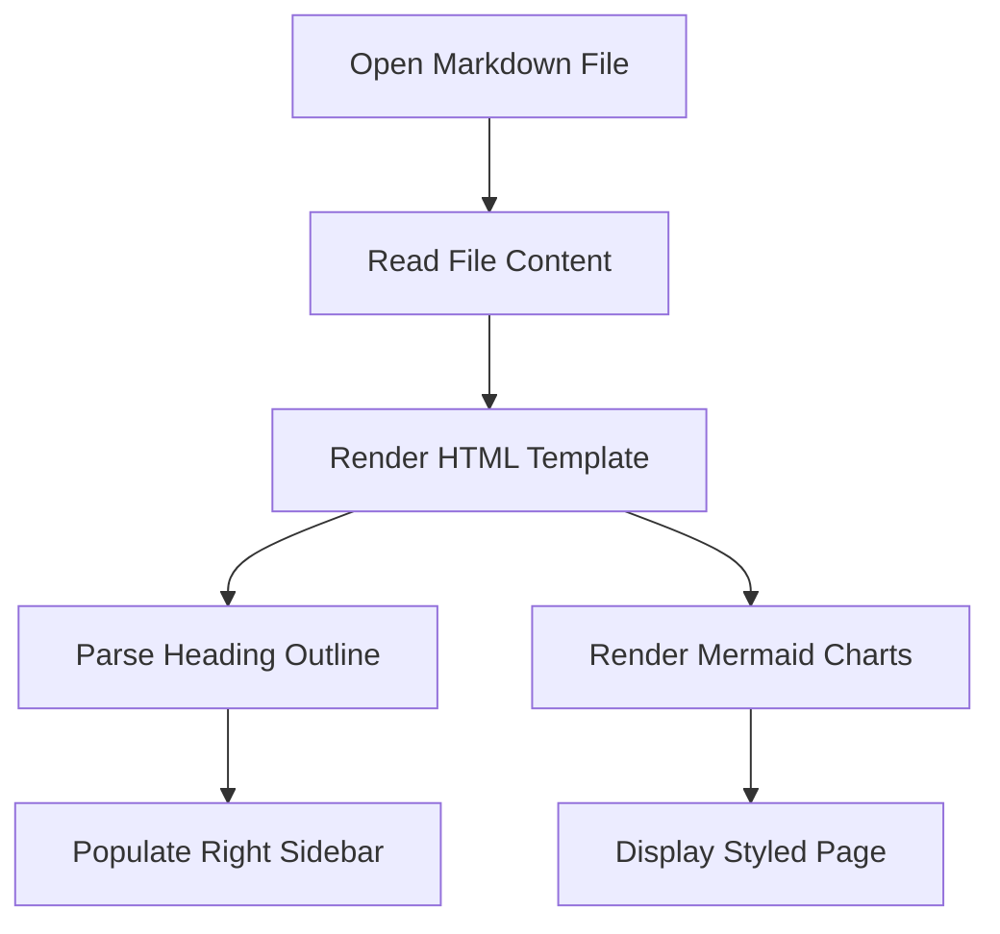

# Antiloop Markdown Viewer

Welcome to the **Antiloop Markdown Viewer**—a premium, offline-first Markdown reader designed specifically for GNOME. This application renders Markdown documents as styled HTML, providing a native look and feel that perfectly integrates with your system theme.

## Core Features

- 📂 **Native File Browser**: View and open all Markdown files in the current directory from the left sidebar.
- 📋 **Document Outline**: Navigate large documents easily using the auto-generated heading outline in the right sidebar.
- 🔄 **History Navigation**: Move back and forward through visited files using mouse side buttons or header bar controls.
- 🌓 **System Theme Sync**: Automatically synchronizes with GNOME light and dark mode preferences.
- 📊 **Mermaid Diagrams**: Fully renders flowcharts, sequence diagrams, and Gantt charts offline.
- 💻 **Syntax Highlighting**: Beautiful theme-synchronized code block formatting.

---

## Mermaid Diagram Example



---

## Code Syntax Highlighting

Here is an example of python code syntax highlighting:

```python
def render_markdown(md_content, parent_dir):
    # Determine light or dark theme
    is_dark = style_manager.get_dark()
    theme = "dark" if is_dark else "light"

    # Render offline template with local assets
    html = assemble_template(md_content, theme)
    webview.load_html(html, f"file://{parent_dir}/")
```

---

## Rich Table Formatting

| Feature | Local Host Version | Flatpak Sandbox Version |
| :--- | :---: | :---: |
| **System Integration** | Direct Path | Containerized |
| **Theme Syncing** | Yes (Native) | Yes (Portal) |
| **Offline Rendering** | Yes | Yes |
| **Hardware Acceleration**| Yes | Yes (DRI) |

---

*Built with ❤️ by Antiloop GmbH.*
